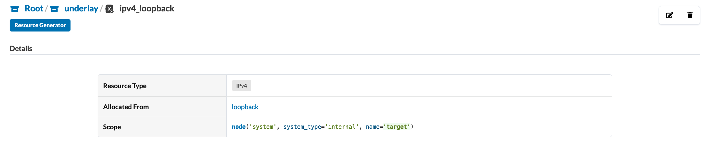
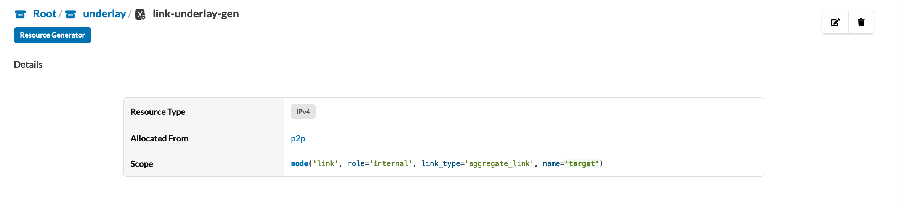
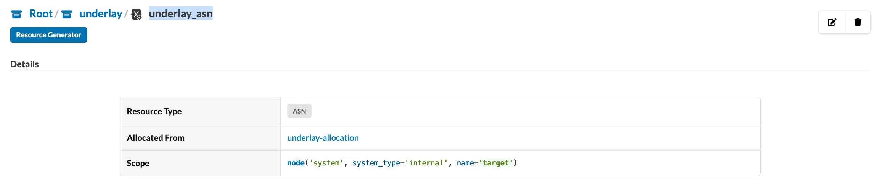
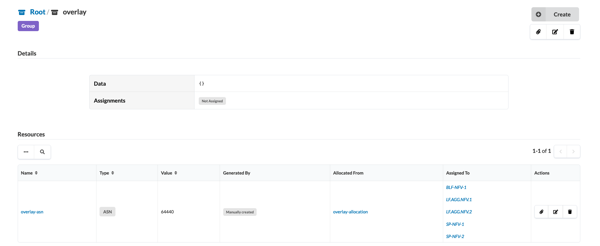
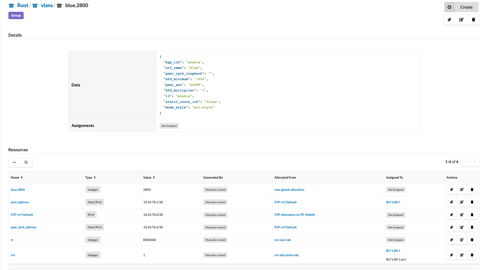

# HOWTO
Here are the basic elements to make the magic happen...
# Create Topology 
1.  Lay out your systems in the editor.
    - Create internal systems for the switches that Apstra will manage:
      
      
    - edit systems information for system internal, this example :
      
      
      
    - Apply system tags to the internal systems to identify leaf and spine
      devices.  These tags should be named "leaf" for leaf devices and
      "spine" for spine devices.
  
## Create Links topology 
2.  Connect your devices.
    - Create link between spine <> leaf, with select device and select port. this example :

       

    - This example after add topology spine leaf :
      
      

    - Host-facing (connect device to external system )links must include either the "mode_access" or "mode_trunk" tags
      to differentiate untagged vs. tagged interfaces.

      

    - Tag the host-facing links with tags to represent the VLANs you want assigned to each host-facing link.  So if you're going to name a VLAN "blue.2800" in your resource group under vlans. select          resource vni (why vni because we need name vlan with bd-vni) then you need a tag assign to target system and interfaces.
      this example :

      

      
    
    NOTE:  Where you have Link Aggregation Goups (LAGs) composed of one or more member links, the tags must be applied to the Aggregated
           link, and not the member links.

# Resource Group Part
  Under Resource Management, create the following:
  
    - Group named "lacp" under Root.
    - Group named “underlay” under Root.
    - Group named “overlay” under Root.
    - Group named “clans” under Root.
    - Group named “vrfs” under overlay.

# Resource Allocation Group Part
    Create the following Allocation Groups to be used in the model:
    - “underlay-allocation” of Type ASN
        This is what we'll use to dynamically assign ASN's to each
        internal system.
    - “loopbacks" of Type IPv4
        Used to generate IPv4 addresses for lo0.0 on each internal system.
    - “p2p of Type IPv4
        Used to generate IPv4 addresses for the fabric interfaces.
    - “overlay-allocation” of Type ASN
        This is what we'll use to dynamically assign ASN's to each
    - "LACP System IDs" of Type Integer
        Use low values for integers (e.g., 1-4094).  We'll use these values
        to generate ESI and LACP System ID values.
      
# Resource Allocation Group Part
# Underlay Part
## loopback Part
```
- Resource generator named “ipv4_loopback” under
    Root/underlay/ipv4_loopback
    Scope: node('system', system_type='internal', name='target')
    Allocation Group: loopback
```
<br>
    loopback capture:
      
 <br>

## point-to-point Part
```
    - Resource generator named “link-underlay-gen” under
      Root/underlay/link-underlay-gen
        - Scope: node('link', role='internal', link_type='aggregate_link', name='target')
        - Allocation Group: p2p
```
<br>
    p2p capture:
        
<br>

## underlay Part
```
    - Resource generator named “underlay_asn” under
      Root/underlay/underlay_asn
        - Scope:node(' system', system_type='internal', name='target')
        - Allocation Group: underlay_allocation
```
<br>
    underlay_asn capture:
        
<br>

## Overlay Part 

## step
```
├── Resource named ‘overlay-asn’ under Root/overlay
    └── Action assign all Internal Device
```
<br>
Overlay Capture :
     
<br>
     
# vrf Part
1. create vrf under overlay with name vrfs
   ## (don't change name : vrfs)
   
3. create vrf name example blue

   
  this describe for data vrf :
  ```
  {
  "vrf_leaking": "disable", > enable or disable for use enable forwarding leaking
  "local_pref": "", > put integer (number) manual local pref leaking prefix
  "vrf_parent": [] > forwarding parent table route
 }
  ```
# vlans Part
## Create vlans
```
    - Resource generator named “vlans” under Root
        - Create Group with name example "blue.2800" > blue is name vlan and 2800 is vlan
        - Enter data as below : 
        {
              "bgp_irb": "disable", > disable/enable
              "vrf_name": "blue", > name of vrf
              "peer_ipv4_loopback": "", > peer ipv4 loopback
              "bfd_minimum": "", > bfd parameter
              "peer_asn": "", > peer asn
              "bfd_multiplier": "", > bfd parameter
              "l3": "enable", > disable/enable
              "static_route_irb": "disable", > disable/enable
              "mode_style": "ent-style" > ent-style/sp-style
        }
        - save
```
<br>
Create vlans Capture :
     
<br>

## Tag vlans
for this vlan tag, the intention is to assign resources which have been explained in the previous part in the Create Links topology part tag vlan. this part only explain how to assign.

select vni resource select assign :


select the internal system to be selected:


select internal system and select interfaces :


# Note: don’t changes named


GOOD LUCK!!!
    
    
